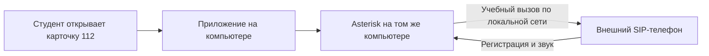

# Подключение внешнего SIP-телефона

РТУ Т16Р или другой SIP-телефон можно использовать вместо браузерного телефона для учебных звонков. Телефон и компьютер с Docker должны находиться в одной локальной сети: например, подключены к одному роутеру. Asterisk — телефонный сервер внутри Docker; приложение отправляет ему команду позвонить на зарегистрированный аппарат и воспроизвести обращение заявителя.



## 1. Подготовить компьютер с приложением

В браузере разрешено подключать SIP-телефон только в защищённом контексте: `localhost` либо HTTPS. При доступе с другого компьютера в локальной сети используйте имя из `ARM_HOST`, например `https://arm112.local:8443`. Имя должно совпадать полностью: `arm112.local`, не `arm12.local`; путь проверки здоровья — `/health`, не `/healt`.

После получения входящего учебного звонка в браузере появляется непрозрачное модальное окно. Пока студент не нажмёт «Принять вызов» или «Отклонить вызов», остальная рабочая область недоступна. После принятия открывается карточка вызова; если вызов отклонён или звонящий сбросил, окно закрывается.

Узнайте IPv4-адрес сетевого подключения компьютера. В Windows откройте терминал и выполните `ipconfig`: нужен IPv4 активного Ethernet или Wi-Fi. В Linux выполните `ip -4 addr`: нужен адрес интерфейса, подключённого к роутеру. Не используйте `127.0.0.1`, адрес внутренней сети Docker или отключённый сетевой интерфейс.

Например, компьютер имеет адрес **192.168.1.20**, телефон — **192.168.1.30**. На телефоне SIP-сервером будет **192.168.1.20**. Телефон не подключается к адресу веб-страницы `http://localhost:8000`, к порту 8000 или 8443: SIP-линия использует UDP/5060.

В `.env` рядом с `docker-compose.yml` измените только нужную строку:

```dotenv
SIP_PUBLIC_ADDRESS=192.168.1.20
```

Укажите свой адрес вместо примера, затем из папки проекта выполните:

```bash
docker compose --profile voip up -d --force-recreate asterisk
docker compose up -d --force-recreate app
```

Эти команды пересоздают компоненты с новым адресом, сохраняя базу данных и карточки. Дождитесь запуска, заново откройте инструкцию SIP-телефона в приложении. Профиль `voip` должен быть запущен; для озвучки также нужен сервис `voice` из профиля `ai`, как при обычном запуске проекта.

Для этой локальной сети разрешите на компьютере входящие **UDP/5060** (регистрация и звонки) и **UDP/10000–10100** (звук), если соединения блокирует брандмауэр. В Docker Desktop проверьте, что порты опубликованы и доступны из LAN. Если IP компьютера меняется, обновите `.env` и повторите команды; можно закрепить адрес за компьютером в настройках роутера.

## 2. Создать линию на телефоне

Подключите аппарат к роутеру, включите его и откройте настройки SIP-линии / учётной записи. Названия меню зависят от модели. В приложении войдите **под тем студентом, который будет отвечать на звонки**, откройте «SIP / IP-телефон · функции» → «SIP-телефон».

| Поле телефона | Что ввести |
| --- | --- |
| Сервер / Registrar / SIP Server | IP компьютера с приложением, например `192.168.1.20` |
| Порт сервера | `5060` |
| Транспорт | `UDP` |
| Имя пользователя / SIP User | Имя из инструкции, например `arm3-hw` |
| Auth ID / имя для авторизации | То же имя, например `arm3-hw` |
| Пароль | Пароль из инструкции: 10 строчных латинских букв и цифр |
| Регистрация / Enable account | Включить |
| Кодеки | G.711A (PCMA), G.711U (PCMU); G.722 при наличии |
| SRTP / шифрование голоса | Выключить для этого учебного профиля |

Пароль индивидуальный и не меняется при повторном открытии инструкции. В нём нет неоднозначных `0`, `O`, `1`, `l`; его можно выделить или скопировать кнопкой. Это **пароль SIP-линии**, а не пароль входа в приложение. После обновления со старой длинной аппаратной строки введите новый пароль на телефоне один раз; браузерные данные остаются действующими.

Сохраните настройки и дождитесь статуса **«Зарегистрирован» / Registered**. Один аппаратный аккаунт рассчитан на один телефон: для другого студента используйте его собственные данные. Аппарат `arm3-hw` и браузер `arm3` регистрируются отдельно.

## 3. Проверить звук и получить звонок

1. На телефоне наберите **900**. Скажите несколько слов: должен вернуться ваш голос с небольшой задержкой. Завершите этот вызов.
2. В приложении откройте карточку **112**, затем нажмите **«Звонок на аппарат»**. Ответьте на физическом телефоне — прозвучит обращение заявителя.
3. Заполняйте карточку в браузере во время разговора; завершение и результаты сохраняются в приложении. Повторные вызовы и записи попыток видны в отчёте преподавателя.

Для браузерного вызова используйте «Подключить телефон» и обычную кнопку звонка. Чтобы вызов поступил на аппарат, нужна именно кнопка «Звонок на аппарат».

## Если подключение не получилось

| Симптом | Что проверить |
| --- | --- |
| В инструкции показано, что адрес не настроен | Изменить `SIP_PUBLIC_ADDRESS` и пересоздать Asterisk и приложение |
| Телефон не регистрируется | IP компьютера, UDP/5060, включение линии, точное имя/Auth ID и пароль; устройства в одной сети, без изоляции клиентов роутера |
| Зарегистрирован, но не слышно звук | UDP/10000–10100, правильный `SIP_PUBLIC_ADDRESS`, кодеки PCMA/PCMU и отключённый SRTP |
| На другом телефоне пропала регистрация | Один аппаратный аккаунт используется двумя устройствами; подключить второй под другим студентом |
| Приложение пишет «Asterisk недоступен» | Запустить профиль `voip` и проверить `docker compose ps` |

Учебные номера **101–104** соединяют с учебными диспетчерами внутри этого Asterisk; городская телефонная сеть и реальные экстренные службы не подключены. Регистрацию и аутентификацию аппаратного профиля проверяем программным SIP-клиентом; проверка клавиш и особенностей физического РТУ Т16Р требует самого устройства.
